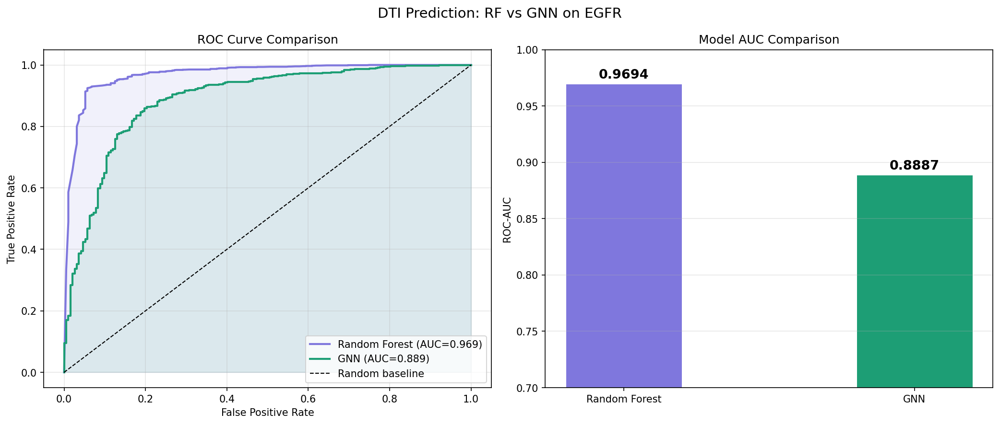
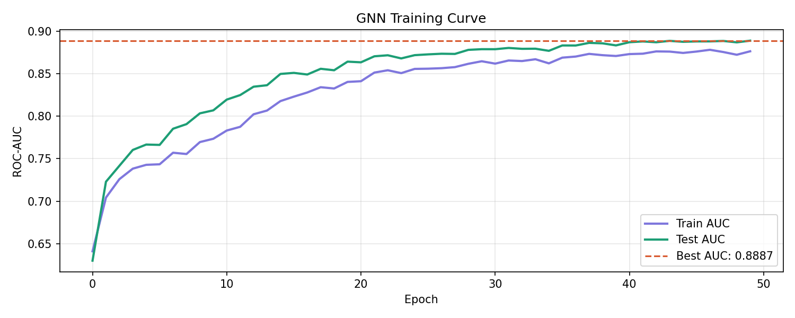
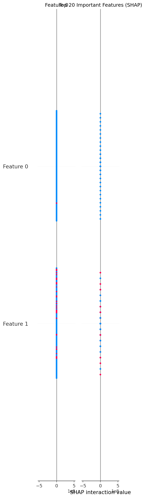
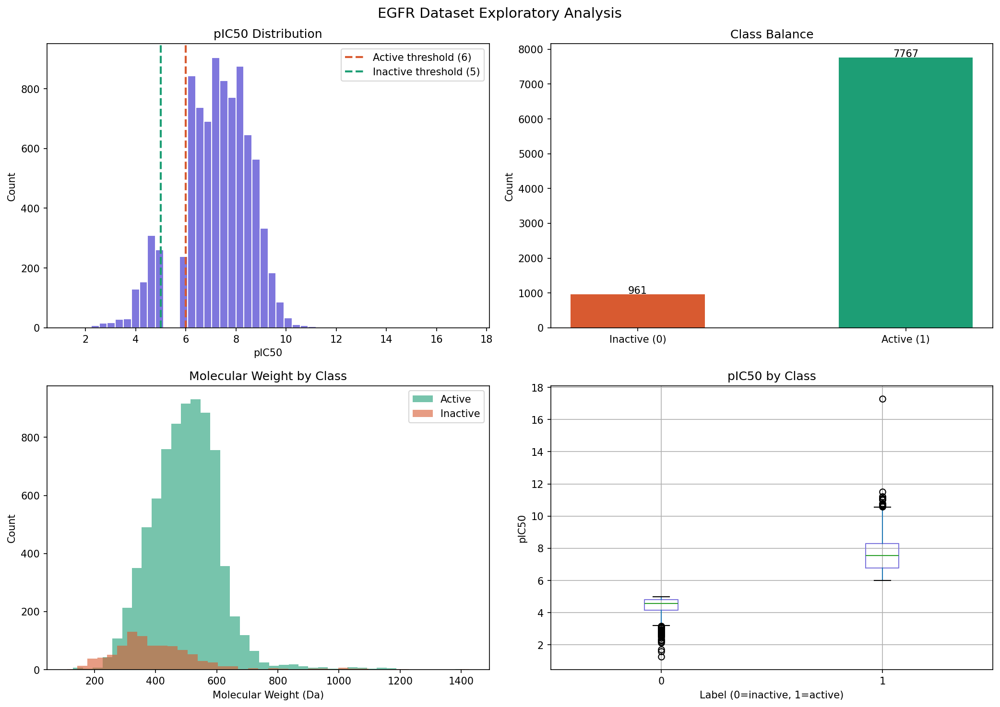

# Drug-Target Interaction Prediction

Predicting EGFR inhibitor activity comparing two ML approaches on 8,728 compounds from ChEMBL.

## Results

| Model | ROC-AUC | Approach |
|-------|---------|----------|
| Random Forest | **0.9694** | Morgan Fingerprints (2048-bit) |
| GNN | 0.8887 | Graph Convolutional Network |

## Key Figures

### Model Comparison


### GNN Training Curve


### Feature Importance (SHAP)


### Dataset Analysis


## Dataset
- Source: ChEMBL database - EGFR (CHEMBL203)
- Raw records: 17,723
- Final compounds: 8,728
- Active (IC50 ≤ 1000 nM): 7,767 (89%)
- Inactive (IC50 ≥ 10000 nM): 961 (11%)
- Mean pIC50: 7.23
- Mean molecular weight: 488.1 Da

## Pipeline
```
ChEMBL API → IC50 data → pIC50 conversion
→ Binary labels → Two ML models → Comparison
```

### Model 1 - Random Forest
- Morgan fingerprints (radius=2, 2048 bits) via RDKit
- 200 decision trees with class_weight=balanced
- 5-fold cross-validation
- SHAP explainability

### Model 2 - Graph Neural Network
- Molecular graph: atoms=nodes (15 features), bonds=edges
- 3-layer GCN with global mean pooling
- 31,106 trainable parameters
- 50 epochs, Adam optimizer

## Why Random Forest outperformed GNN
- Heavy class imbalance (89% active) favours RF
- Limited dataset size (8,728) - GNN needs more data
- GNN AUC still improving at epoch 50 - more training would help
- RF uses class_weight=balanced - GNN does not

## Tools Used

| Tool | Purpose |
|------|---------|
| RDKit | Molecular featurisation |
| scikit-learn | Random Forest, metrics |
| PyTorch | GNN training |
| PyTorch Geometric | Graph convolutions |
| ChEMBL API | Data download |
| SHAP | Model explainability |
| pandas, matplotlib | Analysis + visualisation |

## How to Run
```bash
# Setup
conda env create -f environment.yml
conda activate dti-project

# Run all phases in order
python notebooks/01_data_download.py
python notebooks/02_data_cleaning.py
python notebooks/03_eda.py
python notebooks/04_random_forest.py
python notebooks/05_gnn_model.py
python notebooks/06_comparison.py
```

## Repository Structure
```
dti-prediction/
├── README.md
├── environment.yml
├── data/
│   ├── raw/              # ChEMBL raw download
│   └── processed/        # Cleaned dataset
├── notebooks/            # All 6 pipeline scripts
├── src/
│   ├── fingerprints.py   # Morgan fingerprint functions
│   ├── mol_graph.py      # SMILES to graph converter
│   └── gnn_model.py      # GNN architecture
├── models/               # Saved model files
├── figures/              # All 7 output figures
└── logs/                 # Results CSV files
```

## Author
Vishnuprabha — MSc Bioinformatics
GitHub: github.com/VishnuPrabhaUvaraj
